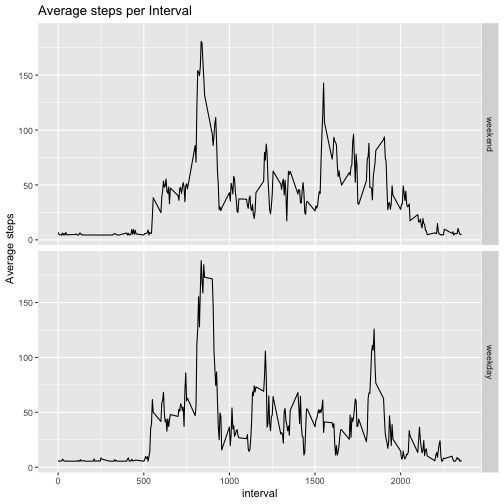

R Markdown Assignment 
=================================
Juan Córdova

To load the data I use read.csv and assign it to variable data.

```r
data <- read.csv("activity.csv")
head(data)
```

```
##   steps       date interval
## 1    NA 2012-10-01        0
## 2    NA 2012-10-01        5
## 3    NA 2012-10-01       10
## 4    NA 2012-10-01       15
## 5    NA 2012-10-01       20
## 6    NA 2012-10-01       25
```

## Question 1

Aggregate the data by day and applying function sum to get total steps per day.

```r
dataDay <- aggregate(data["steps"], by=data["date"], sum, na.rm=TRUE)
```

Create histogram using hist and add vertical lines of mean and median.

```r
hist(dataDay$steps, main="Total steps per day", xlab="Steps per Day", col="blue", breaks=10, xlim=c(0,25000))
abline(v=mean(dataDay$steps), lwd=4, col="red")
abline(v=median(dataDay$steps), lwd=4, col="green")
legend("topright", col=c("red", "green"), legend = c("Mean", "Median"), lty=1)
```


```r
mean1 <- mean(dataDay$steps)
median1 <- median(dataDay$steps)
```

The mean is 9354.2295082 and the median is 10395. 

## Question 2

Aggregate data frame by interval and apply mean function. 

```r
dataInterval <- aggregate(data["steps"], by=data["interval"], mean, na.rm=TRUE)
```

Plot time series wit mean of each interval.

```r
plot(x=dataInterval$interval, y=dataInterval$steps, type="l", col="red", xlab="Interval", ylab="Steps mean", main= "Average steps per interval")
```


Get the max interval.

```r
maxSteps <- which.max(dataInterval$steps)
maxInterval <- dataInterval[maxSteps,1]
```

The max interval is: 835

## Question 3

We get the total number of NA's

```r
numberNA <- sum(is.na(data))
```

The totalnumber of rows with NA's is: 2304

Here I'll change the NA values for the mean of the steps from all observations. 

```r
data2 <- data
data2$steps[is.na(data2$steps)] <- mean(data2$steps, na.rm=TRUE)
```
 
 Aggregate the data by day and applying function sum to get total steps per day.

```r
data2Day <- aggregate(data2["steps"], by=data2["date"], sum, na.rm=TRUE)
```
 
 Plot the steps per day using hist

```r
hist(data2Day$steps, main="New Total Step per Day", xlab="Steps", breaks=10)
abline(v=mean(data2Day$steps), lwd=4, col="red")
abline(v=median(data2Day$steps), lwd=4, col="green")
legend("topright", col=c("red", "green"), legend = c("Mean", "Median"), lty=1)
```


```r
mean2 <- mean(data2Day$steps)
median2 <- median(data2Day$steps)
```

The mean is 1.0766189 &times; 10<sup>4</sup> and the median is 1.0766189 &times; 10<sup>4</sup>

##### Do these values differ from the estimates from the first part of the assignment? What is the impact of imputing missing data on the estimates of the total daily number of steps?
Yes, they differ. Now the median and mean are the same. 

## Question 4

Change class type to date.


```r
data2$date <- as.Date(data2$date, format="%Y-%m-%d")
```

Create a new column with the weekdays function and make it a factor


```r
data2$weekday <- as.factor(weekdays(data2$date))
```

Change the new column's factors to say if it is a weekday or weekend.


```r
data2$weekday <- factor(data2$weekday %in% c("Monday", "Tuesday", "Wednesay","Thurday", "Friday"), levels=c(FALSE,TRUE), labels=c("weekend","weekday"))
```

Prepare data for plotting by grouping observations and getitng total steps. 


```r
library(dplyr)
data2Wday <- data2 %>% 
  group_by(interval, weekday) %>% 
  summarise(meanSteps=mean(steps))
```

```
## `summarise()` has grouped output by 'interval'. You can override using the `.groups` argument.
```

Plot the time series

```r
library(ggplot2)
g <- ggplot(data=data2Wday, aes(x=interval,y=meanSteps))
g+geom_line()+facet_grid(weekday~.)+ggtitle("Average steps per Interval")+ylab("Average steps")
```


